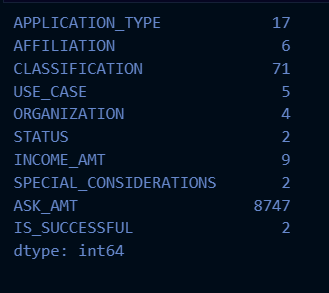
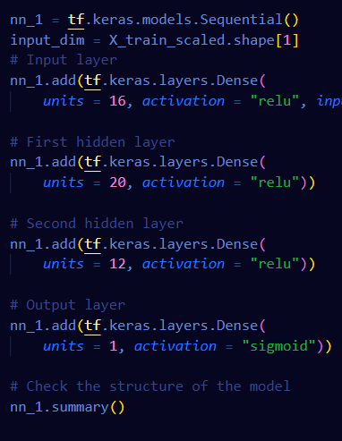
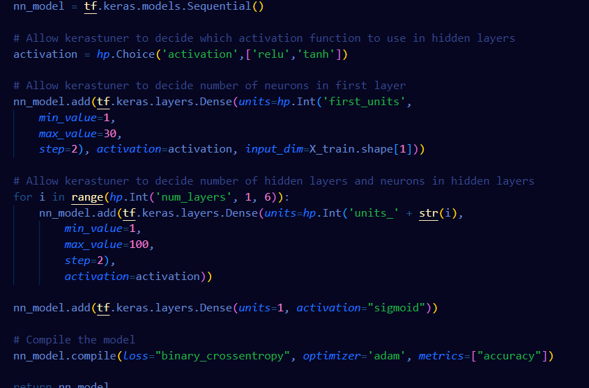
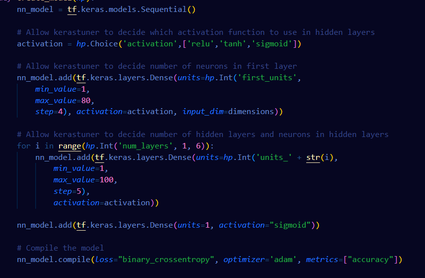

# Deep Learning

### Step 1: Preprocess the Data
Using your knowledge of Pandas and scikit-learn’s StandardScaler(), you’ll need to preprocess the dataset. This step prepares you for Step 2, where you'll compile, train, and evaluate the neural network model.

Using the information we provided in the Challenge files, follow the instructions to complete the preprocessing steps.

* Read in the charity_data.csv to a Pandas DataFrame, and be sure to identify the following in your dataset:
* What variable(s) are the target(s) for your model?
* What variable(s) are the feature(s) for your model?
* Drop the EIN and NAME columns.

1. Determine the number of unique values for each column.

2. For columns that have more than 10 unique values, determine the number of data points for each unique value.

3. Use the number of data points for each unique value to pick a cutoff point to bin "rare" categorical variables together in a new value, Other, and then check if the binning was successful.

4. Use pd.get_dummies() to encode categorical variables.

5. Split the preprocessed data into a features array, X, and a target array, y. Use these arrays and the train_test_split function to split the data into training and testing datasets.

6. Scale the training and testing features datasets by creating a StandardScaler instance, fitting it to the training data, then using the transform function.

### Step 2: Compile, Train, and Evaluate the Model
Using your knowledge of TensorFlow, you’ll design a neural network, or deep learning model, to create a binary classification model that can predict if an Alphabet Soup-funded organization will be successful based on the features in the dataset. You’ll need to think about how many inputs there are before determining the number of neurons and layers in your model. Once you’ve completed that step, you’ll compile, train, and evaluate your binary classification model to calculate the model’s loss and accuracy.

* Continue using the Jupyter Notebook in which you performed the preprocessing steps from Step 1.
* Create a neural network model by assigning the number of input features and nodes for each layer using TensorFlow and Keras.
* Create the first hidden layer and choose an appropriate activation function.
* If necessary, add a second hidden layer with an appropriate activation function.
* Create an output layer with an appropriate activation function.
* Check the structure of the model.
* Compile and train the model.
* Create a callback that saves the model's weights every five epochs.
* Evaluate the model using the test data to determine the loss and accuracy.
* Save and export your results to an HDF5 file. Name the file AlphabetSoupCharity.h5.

### Step 3: Optimize the Model
Using your knowledge of TensorFlow, optimize your model to achieve a target predictive accuracy higher than 75%.

1. Use any or all of the following methods to optimize your model:

* Adjust the input data to ensure that no variables or outliers are causing confusion in the model, such as:
* Dropping more or fewer columns.
* Creating more bins for rare occurrences in columns.
* Increasing or decreasing the number of values for each bin.
* Add more neurons to a hidden layer.
* Add more hidden layers.
* Use different activation functions for the hidden layers.
* Add or reduce the number of epochs to the training regimen.
** Note: If you make at least three attempts at optimizing your model, you will not lose points if your model does not achieve target performance.

1. Create a new Jupyter Notebook file and name it AlphabetSoupCharity_Optimization.ipynb.

2. Import your dependencies and read in the charity_data.csv to a Pandas DataFrame.

3. Preprocess the dataset as you did in Step 1. Be sure to adjust for any modifications that came out of optimizing the model.

4. Design a neural network model, and be sure to adjust for modifications that will optimize the model to achieve higher than 75% accuracy.

5 .Save and export your results to an HDF5 file. Name the file AlphabetSoupCharity_Optimization.h5.

### Step 4: Write a Report on the Neural Network Model

* Overview of the analysis: Explain the purpose of this analysis.

The Alphabet Soup foundation is a non-profit organization who are attempting to identify the most suitable candidates to fund.
I have attempted to do this using machine learning and neural networks. By evaluating the features in the given dataset to forecast the success of candiates in the event that they recieve funding. 

* Results: Using bulleted lists and images to support your answers, address the following questions:

* Data Preprocessing

#### 1. What variable(s) are the target(s) for your model?
The target variable = IS_SUCCESSFUL column, 0/ 1.
#### 2. What variable(s) are the features for your model?
 
  
#### 3. What variable(s) should be removed from the input data because they are neither targets nor features?
 

### 4. Compiling, Training, and Evaluating the Model

#### * How many neurons, layers, and activation functions did you select for your neural network model, and why?

 
#### * Were you able to achieve the target model performance?
Unfortunatelty not, my target was 75%, I reached 73.34% on Test 2, I believe if I would have continued to run this test for a longer period, I may have gotten closer to my desired result.
#### * What steps did you take in your attempts to increase model performance?
I created a function during Test 2 and Test 3 and allowed kerasTuner to decide the number of hidden layers and neurons within the hidden layers in an attempt to increase accuracy, from Test 2 to Test 3 I included the sigmoid activation and pushed max value up from 30 to 80. 
#### * Summary: Summarize the overall results of the deep learning model. Include a recommendation for how a different model could solve this classification problem, and then explain your recommendation.
I'd recommened a Machine Learning model for this in future, Random Forest Classifier and SVM have very good results with Classification problems, and we could use the EIN/ Name columns in hope of achieving a higher result. 
